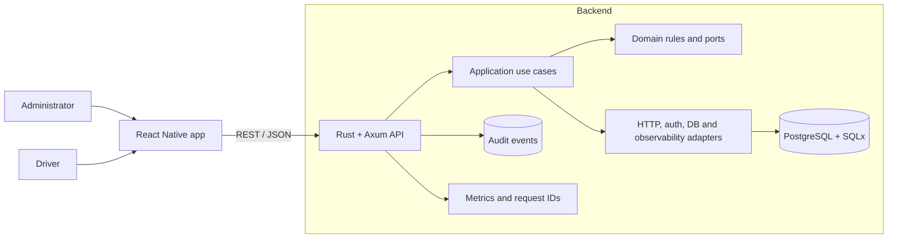

# GasFlow — Mobile Delivery Operations

[](https://github.com/sjo1848/gasflow/actions/workflows/ci.yml)

**Mobile logistics system built with React Native, Rust, Axum and PostgreSQL for scheduled gas-cylinder deliveries, stock control and operational traceability.**

GasFlow digitalizes a local distribution workflow where orders are scheduled in advance, assigned to drivers and reconciled against full and empty cylinder movements. The product prioritizes operational control over instant-delivery marketplace behaviour.

> **Status:** functional MVP under active development. Core backend and mobile workflows are implemented; verified screenshots, a distributable mobile build and a hosted demonstration backend remain pending.

## Business problem

Small delivery operations often coordinate orders, routes, stock and returns using calls, messages and manual notes. That creates avoidable problems:

- Orders are difficult to prioritize and assign.
- Delivery status is not consistently recorded.
- Full and empty cylinders lose traceability.
- Failed deliveries and rescheduling are handled informally.
- Daily operational reporting requires manual reconciliation.

GasFlow converts those activities into explicit workflows and verifiable records.

## What the MVP supports

### Administration

- Schedule orders by date and delivery window.
- Filter and paginate orders.
- Assign orders to drivers.
- Register inbound full-cylinder stock.
- Review stock summaries and daily reports.

### Driver operation

- Authenticate and view assigned orders.
- Record successful deliveries.
- Register full cylinders delivered and empty cylinders received.
- Record failed deliveries with an optional reschedule.

### Operational control

- Order-status transitions.
- Request IDs for HTTP traceability.
- Audit events for critical changes.
- Health and metrics endpoints.
- Network-aware mobile state and local persistence support.

## What this repository demonstrates

| Area | Evidence |
|---|---|
| Mobile development | React Native, Expo, TypeScript and role-oriented navigation |
| Backend engineering | Rust, Axum, Tokio, SQLx and PostgreSQL |
| Architecture | Hexagonal modular monolith with domain, application, ports and adapters |
| State and data access | TanStack Query, Zustand, AsyncStorage and NetInfo |
| Security | JWT authentication and bcrypt password hashes |
| QA | Rust tests, mobile tests, type checking and GitHub Actions |
| Operations | Docker Compose, migrations, metrics, health checks and request tracing |

## Architecture



The backend is deployed as one modular service. Hexagonal boundaries isolate business rules from Axum, JWT and PostgreSQL adapters, preserving a practical path for future evolution without introducing premature microservices.

## Technology stack

### Mobile

- React Native 0.76 and Expo 52.
- TypeScript.
- React Navigation.
- TanStack Query.
- Zustand.
- AsyncStorage and NetInfo.
- React Native Testing Library and Jest.

### Backend

- Rust and Axum.
- Tokio async runtime.
- SQLx and PostgreSQL.
- JWT and bcrypt.
- Utoipa / Swagger UI.
- Structured tracing, metrics and request IDs.

### Infrastructure and quality

- Docker and Docker Compose.
- Versioned database migrations.
- GitHub Actions.
- Backend tests against PostgreSQL.
- Mobile type checking and automated tests.

## Main API flows

### Authentication

- `POST /auth/login`
- `GET /me`

### Orders and dispatch

- `POST /orders`
- `GET /orders?date=&status=&assignee=&page=&page_size=`
- `PATCH /orders/{id}/status`
- `POST /dispatch/assign`

### Delivery execution

- `POST /deliveries`
- `POST /deliveries/failed`

### Stock and reporting

- `POST /stock/inbounds`
- `GET /stock/summary?date=`
- `GET /reports/daily?date=`

### Operations

- `GET /health`
- `GET /metrics`
- Swagger UI at `/swagger-ui`

## Quick start

### Backend and database

```bash
git clone https://github.com/sjo1848/gasflow.git
cd gasflow
docker compose up -d --build
docker compose ps
```

Services:

| Service | Address |
|---|---|
| Backend | `http://localhost:8080` |
| PostgreSQL host port | `localhost:5433` |

Stop the stack:

```bash
docker compose down
```

### Mobile application

```bash
cd mobile
npm install
EXPO_PUBLIC_API_BASE_URL=http://localhost:8080 npm run start
```

For an Android emulator, the API host may need to use the emulator-specific host address rather than `localhost`.

## Validation

### Backend

```bash
cd backend
cargo fmt --check
cargo test
```

### Mobile

```bash
cd mobile
npx tsc --noEmit
npm test -- --runInBand
```

The CI workflow runs backend tests against a PostgreSQL service and validates mobile type safety and tests on every push and pull request to `main`.

## Development credentials

The development seed includes example administrator and driver accounts. These credentials are for local development only and must never be reused in a public or production deployment.

## Documentation

- [Portfolio case study](docs/PORTFOLIO_CASE_STUDY.md)
- [Implementation status](docs/PROJECT_STATUS.md)
- [Product requirements](docs/PRD.md)
- [Architecture](docs/ARCHITECTURE.md)
- [Backlog](docs/BACKLOG.md)
- [Architecture decisions](docs/adr/)

## Current priorities

- Add verified mobile screenshots and a short walkthrough.
- Produce a reproducible Android build.
- Validate intermittent-connectivity behaviour through automated scenarios.
- Add a controlled demonstration backend.
- Test workflows with realistic delivery volumes and stock reconciliation cases.

## Scope note

GasFlow is a portfolio-grade MVP for a specific local distribution workflow. Production use would require deployment-specific security, privacy, monitoring, support, device management and operational validation.