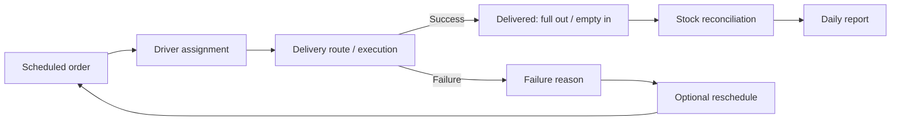

# GasFlow — Portfolio Case Study

## Executive summary

GasFlow is a mobile logistics MVP for scheduled gas-cylinder distribution. It combines a React Native client with a Rust/Axum backend and PostgreSQL persistence to coordinate orders, driver assignment, deliveries, failed-delivery handling, stock movements and daily reporting.

The project demonstrates end-to-end product delivery across mobile UX, backend architecture, relational persistence, security, testing and operational traceability.

## Operational context

A local distribution business does not necessarily need an instant-delivery marketplace. Its main problems are operational:

- Orders arrive through fragmented channels.
- Delivery windows and priorities are difficult to coordinate.
- Drivers need a clear list of assigned work.
- Full and empty cylinders must be reconciled.
- Failed deliveries require a controlled reason and optional reschedule.
- Management needs a daily operational view without rebuilding it manually.

GasFlow treats these activities as one connected operational cycle.

## Product model

## Architecture

The backend uses a modular hexagonal monolith:

- **Domain:** entities and operational invariants.
- **Application:** use cases for orders, dispatch, deliveries, stock and reports.
- **Ports:** persistence, authentication and infrastructure contracts.
- **Adapters:** Axum HTTP handlers, SQLx repositories, JWT and observability.

This structure keeps the deployment simple while protecting the business model from framework and database coupling.

## Key technical decisions

### One mobile application for two operational roles

The MVP uses one React Native application with administrator and driver modes. This reduces duplicated release and maintenance work while preserving role-specific navigation and actions.

### Scheduled delivery rather than on-demand marketplace logic

The product explicitly models delivery dates and windows. This matches a local operation that plans work rather than competing for real-time dispatch.

### Quantitative stock reconciliation

The MVP tracks full and empty cylinder quantities instead of individual serialized assets. This keeps the first version operationally useful without adding asset-level complexity prematurely.

### Rust modular monolith

Rust and Axum provide a strongly typed backend with predictable runtime behaviour. A modular monolith is used instead of microservices because the current domain benefits from shared transactions and a simple deployment model.

### Traceability from the first version

Request IDs, structured logs, metrics and audit events are included because delivery and stock discrepancies require a reviewable history.

## Quality strategy

The repository validates both sides of the product:

- Rust formatting and backend tests.
- PostgreSQL-backed integration behaviour.
- Mobile TypeScript checks.
- Jest and React Native Testing Library tests.
- GitHub Actions for backend and mobile quality gates.

Additional production-oriented validation remains pending for intermittent connectivity, larger datasets and real-device distribution.

## Security baseline

- JWT authentication.
- Bcrypt password hashing.
- Protected operational routes.
- Development credentials isolated to seed usage.
- Database migrations and configuration through environment variables.

This is a baseline for an MVP, not a security certification. A public deployment would require secret rotation, transport/security review, abuse controls, device/session policy and operational monitoring.

## UX considerations

The mobile application is structured around operational roles rather than generic database screens:

- Administrators see pending work, assignment, stock and reports.
- Drivers see assigned work and delivery outcomes.
- Navigation and status actions follow the delivery lifecycle.
- Local storage and network-state awareness support the path toward intermittent-connectivity resilience.

## Evidence in the repository

| Capability | Evidence |
|---|---|
| Mobile application | `mobile/` React Native + TypeScript implementation |
| Backend API | `backend/` Rust + Axum implementation |
| Database | SQLx migrations and PostgreSQL Docker service |
| Architecture | `docs/ARCHITECTURE.md` and source boundaries |
| Product definition | `docs/PRD.md` and backlog |
| Automated QA | `.github/workflows/ci.yml` and test suites |
| API documentation | Utoipa / Swagger UI |
| Operational tracing | Request IDs, metrics and audit events |

## Current limitations

- No hosted backend demonstration is linked.
- No reproducible public Android package is attached.
- Screenshots and a short product walkthrough are pending.
- Intermittent-connectivity behaviour needs broader automated validation.
- Stock is quantity-based rather than serialized per cylinder.
- Route optimization is outside the current MVP.

## Next milestones

1. Capture verified administrator and driver screenshots.
2. Record a complete scheduled-order-to-delivery walkthrough.
3. Produce a reproducible Android build.
4. Expand offline and reconnection tests.
5. Add realistic data-volume and stock-reconciliation scenarios.
6. Publish a constrained demonstration backend.
7. Tag a stable portfolio release.

## Professional relevance

GasFlow demonstrates the ability to connect product analysis, mobile development and backend engineering around a real operational workflow. It is especially relevant to logistics, field operations, inventory control and software for small or medium distribution businesses.